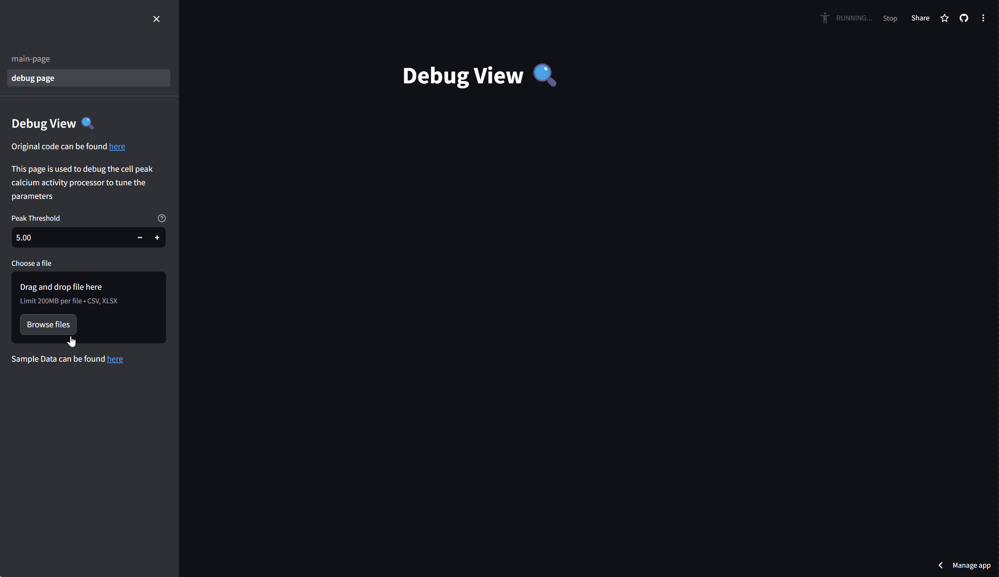

# cell-peak-calcium-activity-process
[](https://github.com/ninja-asa/cell-peak-calcium-activity-processor/actions/workflows/unit-tests.yml)

[](https://opensource.org/licenses/MIT)
[](https://cell-peak-calcium-activity-process.streamlit.app/) 

The goal with this repository is to support a scientific workflow to:

- [x] read time series for a variable number of cells with their respective peak calcium activity
- [x] process each time series to
    - [x] detect the peaks that are above a certain threshold
    - [x] record the amplitude of the greatest peak 
    - [x] record the time of the greatest peak
    - [x] record the amplitude of the first peak
    - [x] record the time of the first peak
    - [x] count number of peaks
    - [x] if any peak is detected, consider cell as active
- [x] obtain general statistics for the population of cells
    - [x] total number of cell
    - [x] number of active cells
    - [x] % of active cells
    - [x] average number of peaks per cell
    - [x] average amplitude of peaks
- [x] plot the time series for each cell
- [x] Allow user to set the threshold for peak detection
- [x] Allow user to exclude first `n` samples or `t` time units from the time series
- [x] allow processing of multiple files
- [x] allow user to set conditions to filter out cells
- [x] export (cell) results per excel file
- [x] export (population) results in a summary excel file (single file for all processed files)
- [ ] allow user to edit column names in the excel files ()
- [x] be a web application

## Getting Started
:exclamation: Have only tested with python 3.12.

### Usage via Deployed Web App
- Access streamlit app: [https://cell-peak-calcium-activity-process.streamlit.app/](https://cell-peak-calcium-activity-process.streamlit.app/) 
- To plot the time series of a data file (to device better parametrization), select page `debug-page`
> Check section [Supported File Format](#supported-file-format) for detailed information



- To process several data files, access `main-page`, upload target data files and perform the desired configuration.
> To better understand the existing parameters, check section [Configuration of Pipeline](#configuration-of-pipeline).


### Usage via Command Line Interface
#### Setup
-   Clone the repository and open a terminal in the root directory of the repository
-   Create a virtual environment by running `python -m venv myenv`
-   Activate the virtual environment by running `source myenv/bin/activate`
-   Install the dependencies by running `pip install .`
-   Create a `.env` file in the root directory with the content of `example.env` adjusted to your needs

### Process
- Ensure that python virtual environment is active. If not, run `source myenv/bin/activate` 
- Generate the results by running the pipeline:
```bash
python app <path_to_directory_with_files> 
```
for example
```bash
python app samples/
```
- Results will be saved in the specified `output_directory` in the `.env` file, uniquely identied with the date and time of generation. Check section [Pipeline Results](#pipeline-results).


### Supported File Format
- The files should be in `.csv` format or `.excel`
- The files must contain a time index at least (column containing "Time")
- The files must contain at least a numeric column with the calcium activity of the cells overtime
- If `excel`, it only reads the first sheet
- In `samples/` there are some example files for both types
- The column containing `Frame` is dropped
- The column containing `Time` is used as the time index
- The other columns can be freely named, as long as they are strings (text)
- Rows with missing values are dropped
- Column with non numeric values are dropped


### Configuration of Pipeline

- `PEAK_THRESHOLD`: This is the threshold for peak detection. A local maximum will only be considered a peak if above this threshold.

- `PEAK_WINDOW`: This is the window size for peak detection. The algorithm will consider this many samples on either side of a point to determine if it is a peak. 

- `TIME_UNIT`: This is the unit of time used in the data, either `s` or `ms`.

- `IGNORE_PEAKS_BEFORE_CRITERIA`: This determines the criteria for ignoring early peaks in the data, either `time` or `samples`.

- `IGNORE_PEAKS_BEFORE`: This is the number of samples or time (depending on `IGNORE_PEAKS_BEFORE_CRITERIA`) to ignore at the start of the data. The default value is `1`.

- `OUTPUT_DIRECTORY`: This is the directory where the output files will be saved. The default value is `"output"`.

- `LOGGING_LEVEL`: This determines the level of logging. The default value is `"INFO"` which means it will log information messages, as well as warning and error messages.

- `FILTER_SETTINGS`: This is used to remove columns with values below or above the specified values. The format is `value,direction;value,direction`. For example, `0.0,below;10,above` will remove columns with values below `0.0` or above `10`. Remove this line if not needed.

### Pipeline Results
- Via CLI:
    - The results are stored in the specified output directory in `.env`
    - If the output directory does not exist, it is created.
    - The results are stored in a directory with the current timestamp
- Via Web App:
    - Web App allows to download a `.zip` file named with the current timestamp 
- The results are stored in `.csv` and `.excel` format - according to the file format of the input files.
- The results are stored in the following structure (below is an example from using `samples/` files):
```
output/
└── 20240507214916
    ├── all_populations_summary.csv
    ├── sample_features.csv <-- features of interest per timeseries of `samples/sample.csv`
    ├── sample_features.xlsx <-- features of interest per timeseries of `samples/sample.xlsx`
    ├── all_populations_summary.csv <-- aglomerated summary of all files of below files
    ├── sample_summary.csv <-- from processing `samples/sample.csv`
    └── sample_summary.xlsx <-- from processing `samples/sample.xlsx`
```
- The `all_populations_summary.csv` contains the summary of all processed files with the following tabular format:

|                                                                      | mean time_to_first_peak | mean value_at_first_peak | mean time_to_max_peak | mean value_at_max_peak | mean nr_peaks | nr_true is_active | percentage_true is_active | total_instances |
| :------------------------------------------------------------------- | :---------------------- | :----------------------- | :-------------------- | :--------------------- | :------------ | :---------------- | :------------------------ | :-------------- |
| sample.csv  | 4.75                    | 10.0                     | 4.75                  | 10.0                   | 1.0           | 2.0               | 100.0                     | 2.0             |
| sample.xlsx | 4.75                    | 10.0                     | 4.75                  | 10.0                   | 1.0           | 2.0               | 100.0                     | 2.0             |
|                                                                      |                         |                          |                       |                        |               |                   |                           |                 |
- The `sample_features.csv` contains the features of interest per timeseries of `samples/sample.csv` with the following tabular format:

| 0      | time_to_first_peak | value_at_first_peak | time_to_max_peak | value_at_max_peak | is_active | nr_peaks |
| :----- | :----------------- | :------------------ | :--------------- | :---------------- | :-------- | :------- |
| cell 1 | 4.5                | 10.0                | 4.5              | 10.0              | True      | 1.0      |
| cell 2 | 5.0                | 10.0                | 5.0              | 10.0              | True      | 1.0      |
### Development Environment
- Clone the repository
- Open the repository in VSCode
- Setup intended Python version in the `Dockerfile.dev`
- Press `F1` and type `Remote-Containers: Reopen in Container`
- Start developing

## Common Issues
### Dev Container Cannot Start - Issue with communicating with Docker Enginer
Repro steps:
- Ensure docker enginer is running
- Have the required base docker image stored cached 
- Attempt to `Open in Container` or `Rebuild and Open in Container` in repository

Issue:
- Visual Studio Code gets stuck
- Dev Containers extension Logs we can see an issue of Visual Studio Code server communicating with docker engine: whenever a docker command is called, an error with the API is reported

Attempts:
- Restart Visual Studio Code
- Restarted Docker
- Restart computer
  
Solution:
- Updated Docker

### Dev Container Cannot Start - Network issue
Repro steps:
- Ensure docker enginer is running
- Attempt to `Open in Container` or `Rebuild and Open in Container` in repository

Issue:
- Dev container cannot start building
 
Solution:
- Have no internet connectivity to get docker image from remote registry
